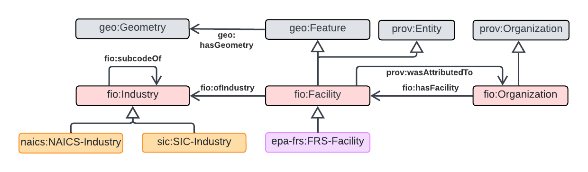

# FIO

The Facilities and Industries Ontology provides a representation of facilities and their industry classification(s). It is extended by the FRS ontology that incorporates facilities in the US from EPA's facility registry service (<https://www.epa.gov/frs>) , and the NAICS and SIC ontologies that populate these two industry classification schemes.

## Schema Diagram

[FIO ontology schema diagram](https://lucid.app/lucidchart/0b649dc4-e466-4d29-ae34-5c0f113f5a46/edit?viewport_loc=-1453%2C-27%2C2951%2C1455%2Cq4u-GszAWYkJ&invitationId=inv_0e3483a0-96fc-4faf-8c17-1a5bf73fd23b)

 The ontology is implemented at [/ontology/FIO.ttl](/ontology/FIO.ttl) and the documentation is hosted at: [https://theskailab.github.io/fio/index-en.html](https://theskailab.github.io/fio/index-en.html)
 
 The ontology is instantiated by the datasets for NAICS and EPA FRS in [/datasets](/datasets)
 The dataset folders contain:
     ** Dataset ontology that serves that aligns dataset terms to FIO
     ** instances or a sample of instances (for epa-frs) 
     ** python scripts used to triplify the dataset
