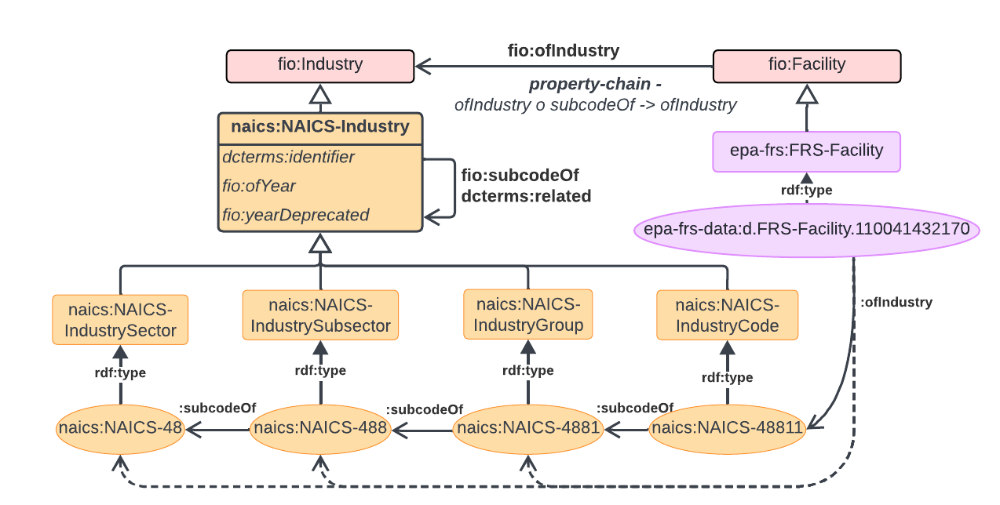
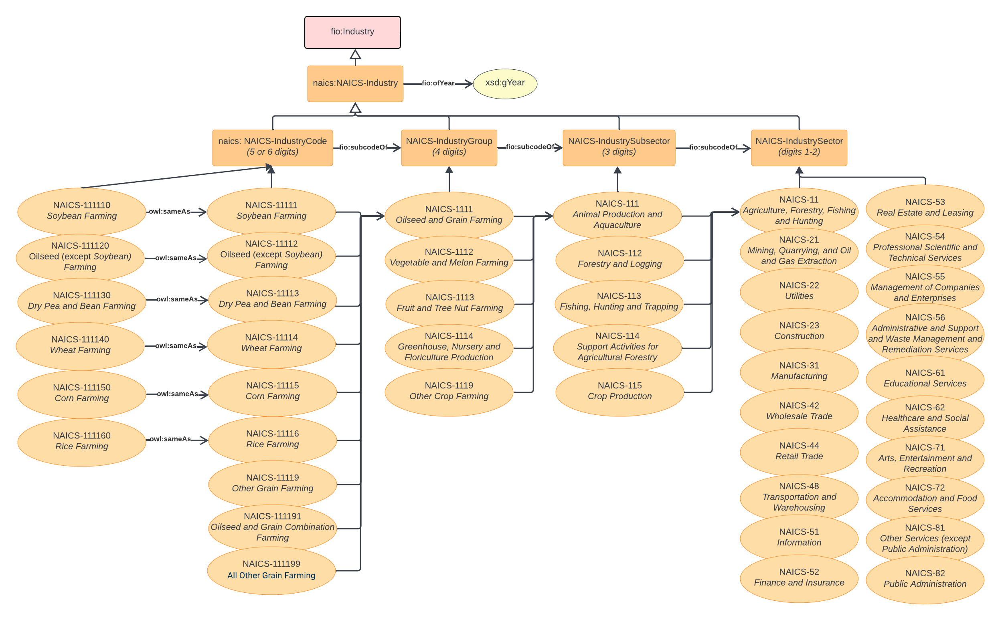
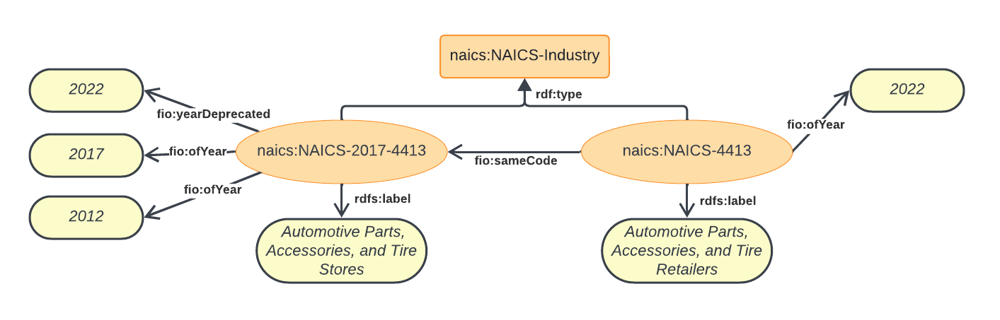

# NAICS ontology

The NAICS ontology is a dataset specific ontology that models industry classifications according to the North American Industry Classification System as published by the U.S. Census Bureau.

## Schema Diagram

