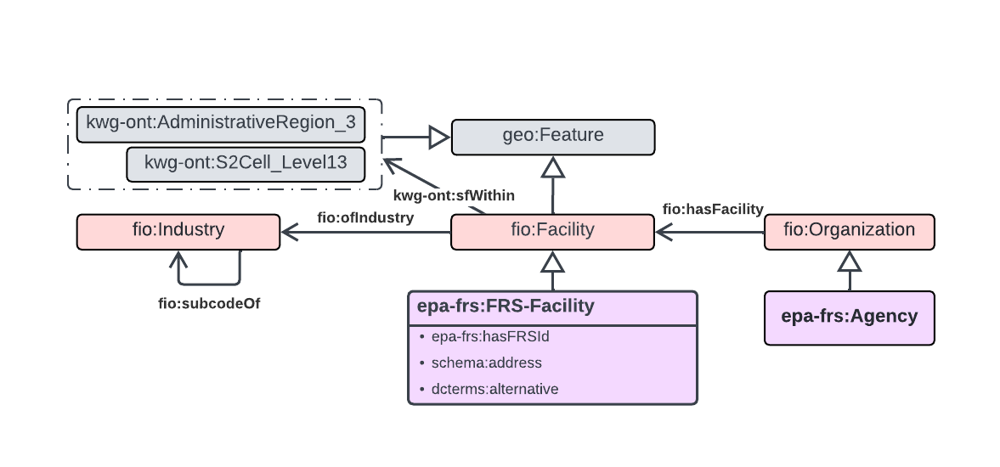

# Overview of the raw dataset

* **Name of dataset:** Facility Registry Service
* **Source Agency:** EPA
* **Data source location:**
  * [Envirofacts Data Service API](https://data.epa.gov/efservice/) (note: requires further query parameters to resolve, e.g. [example 1](https://data.epa.gov/efservice/FRS_FACILITY_SITE/STD_STATE_CODE/=/ME/COUNT), [example 2](https://data.epa.gov/efservice/FRS_FACILITY_SITE/STD_STATE_CODE/=/ME/rows/0:2/JSON) )
  * [FRS State Downloads](https://www.epa.gov/frs/epa-state-combined-csv-download-files)
*note: there are many ways to access FRS data, such as via ECHO, state downloads contain industry codes*
* **Additional Data source:**
  * [Industry Sectors Data](https://echo.epa.gov/trends/pfas-tools#data) *note: this identifies facilities the epa suspects are using pfas*
  * [program reference](https://usepa.servicenowservices.com/oeca_icis/en/list-of-program-system-acronyms-found-in-icis?id=kb_article_view&sys_kb_id=42327c7f1bfc1954fd044262f54bcb8f)
* **Metadata description:**
  * [Envirofacts api documentation](https://www.epa.gov/enviro/envirofacts-data-service-api)
  * [API viewer](https://enviro.epa.gov/envirofacts/metadata/api-viewer)
  * [Envirofacts model page](https://enviro.epa.gov/envirofacts/metadata/model)
  * [Envirofacts table model(example)](https://enviro.epa.gov/envirofacts/metadata/table/frs/v_pub_frs_naics_ez)
  * [frs data dictionary](https://www.epa.gov/sites/default/files/2015-09/documents/frs_data_dictionary.pdf)
  * [Facility State File Documentation 1132012_new](https://www.epa.gov/frs/epa-state-combined-csv-download-files) (comes with state download)
  * [Environmental Interest Types](https://www.epa.gov/sites/default/files/2020-01/documents/interest_types.pdf)
* **Format of data returned:** json, zip of csv (state downloads)
* **Data update interval:**
* **General Comments**:

## Schema Diagram

### Overview

### Records and Environmental Interest

.png)

### Program Information Systems and Organizations

.png)

* [WIP](https://lucid.app/lucidchart/0b649dc4-e466-4d29-ae34-5c0f113f5a46/edit?viewport_loc=-1067%2C1107%2C3523%2C1881%2CcJplkqIup7-.&invitationId=inv_0e3483a0-96fc-4faf-8c17-1a5bf73fd23b)

## Raw Data Attribute List and Mappings with Ontology

 FRS State Downloads (11 csv files per state), or API access via table

### FRS_FACILITY_SITE api table (joined with GEO_FACILITY_POINT) / *_FACILITY_FILE.csv

* **API CODE**: \us-frs\facilities_api.py
* **from file code(outdated):**\us-frs\older_scripts\facilities_statedownload.py
* **[REFERENCE](https://enviro.epa.gov/envirofacts/metadata/table/frs/frs_facility_site)**

| State CSV download Attribute    | API Attribute |  Description  | **Lift to Graph** | **Ontology Property**    |
|--------------|--------------|---------------|----------------------|------|
| STATE_NAME   | state_name |   | No  |    |
| LOCATION_ADDRESS   |location_address | The address that describes the physical (geographic) location of the front door or main entrance of a facility site, including urban-style street address or rural address.| No |    |
| UPDATE_DATE | update_date, last_reported_date | A system-generated value that represents the most recent calendar date and time the corresponding information was updated in the database.  | **Yes** | epa-frs:FRS-Facility schema:dateModified xsd:date   |
| |  std_full_address | The standardized complete address including STD_LOC_ADDRESS STD_CITY_NAME STD_STATE_CODE  AND STD_POSTAL_CODE.  | Yes | epa-frs:FRS-Facility schema:address (xsd:string)|
| | user_id | The user ID of the person who entered the data or the method by which the data was entered into the system. | No | |
| |  std_city_name | standardized locality name - nameof city, town village or other locality within whose boundaries (the majority of) the facility site is located.  | No  |    |
| COUNTRY_NAME | country_name |   | No  |    |
| TRIBAL_LAND_NAME | tribal_land_name | Name of Tribal Reservation, statistical area, or Public Domain Allotment.      | ?    |  |
| (FEDERAL_AGENCY_NAME)  | federal_agency_code  | code of federal agency (or name as derived from FEDERAL_AGENCY_CODE lookup)  The Federal Agency/Bureau code. The five character code consists of a letter followed by  four numbers. There are four possible letters that can occupy the first character position: 'C' for Civilian Federal Agency; 'D' for Department of Defense; 'E' for Department of Energy; 'X' for Unknown. The second and third characters represent the agency code, while the fourth and fifth characters represent the bureau code. | **Yes** | epa-frs:FRS-Facility prov:wasAttributedTo epa-frs:Agency (in URI)  |
| | std_stype_before | street prefix| No | |
| | std_base_name | The name of the street or road, not including the prefix, suffix, or pre- or postdirectional codes. | No ||
| | std_stype_after | street suffix| No ||
| | refresh_date | The date the data was last extracted from the data source. | No ||
| | parent_registry_id |  The unique identification number, assigned by the EPA Facility Registry System, to the parent facility site (for example, the SDWIS water system). | **??** ||
| | std_name| The primary name after a set of standardization rules are applied for comparison purposes. The rules include removing special characters and certain words (e.g., /, Inc.) and replacing abbreviated words with standardized equivalents (e.g., Assoc becomes Association). | **Yes** | epa-frs:FRS-Facility dcterms:alternative  |
| CREATE_DATE | create_date | date first posted to database  |  **Yes** |  epa-frs:FRS-Facility dcterms:created xsd:date  |
| CITY_NAME | city_name | locality name - nameof city, town village or other locality within whose boundaries (the majority of) the facility site is located.  | No  |    |
| FEDERAL_FACILITY_CODE | federal_facility_code   | Yes/No the facility is property of the Federal Government    | **Yes**     | epa-frs:FRS-Facility epa-frs:ofFacilityType epa-frs-data:d.Federal-Facility |
| TRIBAL_LAND_CODE | tribal_land_code  | Code indicating whether or not the facility site is located on tribal land.  | **Yes**  |  epa-frs:FRS-Facility epa-frs:ofFacilityType epa-frs-data:d.Tribal-Facility  |
| SITE_TYPE_NAME   | site_type_name | The descriptive name for the type of site the facility occupies.  Allowable Values: [ Stationary, Monitoring Site, Brownfields Site, Water System ,  Contamination Addressed,  Contaminated Site,  Potentially Contaminated Site  ]  | **Yes**     |  epa-frs:FRS-Facility epa-frs:ofFacilityType (builds URI of epa-frs:FacilityType) |
| **REGISTRY_ID**  | **registry_id** | registry id to uniquely identify facility  | Yes     | epa-frs:FRS-Facility (in URI)  epa-frs:hasFRSid (xsd:string, owl:subPropertyOf dcterms:identifier ) |
| **PRIMARY_NAME** | **primary_name**| public or commercial name| **Yes**    | epa-frs:FRS-Facility rdfs:label (xsd:string) |
|   | std_state_code | USPS abbreviation for state - corrected/standardized   |  For initial filter only |    |
| COUNTY_NAME  | county_name|  | No      |    |
| | small_bus_ind| | **Yes** | epa-frs:FRS-Facility epa-frs:ofFacilityType epa-frs-data:d.SmallBusiness-Facility|
| | std_street_name| The name assigned to a street or road, not including other urban-style street address components.| No ||
| | interest_status_code| Null | No ||
| | review_reason| The reason the record is flagged for manual review. | No ||
| POSTAL_CODE  | postal_code |  5 digit zip code and 4 digit extension code (if available)   | No  |    |
| | sensitive_ind|Indicates whether or not the associated data is enforcement sensitive. | No ||
| | operating_status|| No ||
| | std_county_fips| county fips code (state and county)  | **Yes**?     | epa-frs:FRS-Facility kwg-ont:sfWithin kwg-ont:AdministrativeRegion_2      |
| FIPS_CODE    | fips_code| county fips code (state and county)  | No     |      |
| | stand_alone_flag | Indicates whether or not the facility is standalone (i.e., only one environmental interest is linked to the facility) or multimedia (more than one environmental interest is linked to the facility).'Y' means the facility is standalone, and 'N' means the facility is not standalone.| No ||
| | std_house_number || No ||
| LOCATION_DESCRIPTION  |  location_description | Descriptive information about location of facility, including directions.      |  No |    |
| |std_county_name |  | No      |    |
| | std_prefix|| No ||
| | std_country |   | No  |    |
| | icis_identifier | This column is not currently being used. | No ||
| | public_ind | Indicates whether or not the associated data is accessible by the public on the Internet. |No - only public data accessed ||
| | review_flag |A flag that indicates the record requires a manual review due to changes from a data source | No ||
| SUPPLEMENTAL_LOCATION |  supplemental_location  | text that provides additional information about a place, including a building name with its secondary unit and number, an industrial park name, an installation name or descriptive text where no formal address is available. | No? |    |
| EPA_REGION_CODE  | epa_region_code | The code that represents an EPA Region.    | No |    |
| STATE_CODE   | state_code, std_state_code | USPS abbreviation for state    |  For initial filter only |    |
| | data_quality_code| Quality of the location | No ||
| | addr_type|The type of address given in the LOCATION_ADDRESS column (i.e., standard urban, PO Box). | No ||
| | std_postal_code |  5 digit zip code and 4 digit extension code (if available)   | No  |    |
| | last_reported_date | | | |
| CONGRESSIONAL_DIST_NUM | legislative_dist_num  | The number that represents a Legislative District within a state. | No |    |
| | std_loc_address|| No ||
| | std_suffix|| No ||
| LATITUDE83   | frs.GEO_FACILITY_POINT.latitude83 | | **Yes**     |  epa-frs:FRS-Facility geo:hasGeometry/geo:asWKT  |
| LONGITUDE83  | frs.GEO_FACILITY_POINT.longitude83 | | **Yes**     |  epa-frs:FRS-Facility geo:hasGeometry/geo:asWKT  |
| | env_justice_code| Note:Dropped from schema in April 2025. The code that identifies the type of environmental justice concern affecting the facility or enforcement action.| No ||

### frs.frs_program_facility

* **[REFERENCE](https://enviro.epa.gov/envirofacts/metadata/table/frs/frs_program_facility)**
* **API CODE**: \us-frs\facilities_program_records.py
* This table primarily bridges between the standard facility site table and any program information system data

| API Attribute |  Description (/example)  | Lift to Graph | Ontology Property    |
|--------------|---------------|----------------------|------|
|  addr_type| null| | |
|  city_name| LANDOVER HILLS| | |
|  country_name| UNITED STATES| | |
|  county_name| PRINCE GEORGE S| | |
|  create_date| null| **Yes**| epa-frs:Record dcterms:created|
|  data_quality_code| null| ? | |
|  epa_region_code| 03| | |
|  federal_agency_code| null| | |
|  federal_facility_code| null| | |
|  fips_code| null| | |
|  huc_code_12| null| | |
|  huc_code_8| null| | |
|  last_reported_date| null| | |
|  legislative_dist_num| null| | |
|  location_address| 7401 ANNAPOLIS RD| | |
|  location_description| null| | |
|  pgm_sys_acrnm| RCRAINFO|**Yes** | epa-frs:Record epa-frs:fromSystem (URI of epa-frs:ProgramInformationSystem) (also used in record iri with standardization) |
|  ***pgm_sys_id***| MDR000525591|**Yes** | URI of epa-frs:Record (with standardization) |
|  postal_code| 20784| | |
|  primary_name| CVS PHARMACY 1443| | |
|  public_ind| Y| | |
|  refresh_date| 29-JUL-16| | |
|  **registry_id**| **110045544700**| Yes | epa-frs:FRS-Facility(in uri) epa-frs:hasRecord epa-frs:Record |
|  sensitive_ind| null| | |
|  site_type_name| null| | |
|  small_bus_ind| null| | |
|  source_of_data| RCRAINFO| | |
|  state_code| MD| | |
|  state_name| MARYLAND| | |
|  supplemental_location| null| | |
|  tribal_land_code| N| | |
|  tribal_land_name| null| | |
|  update_date| null| **Yes** | epa-frs:Record dcterms:updated|
|  user_id| null | | |

### frs.frs_interest   /   ME_ENVIRONMENTAL_INTEREST_FILE.csv

* Classifies type of environmental interest in facility across all EPA agency subprograms and state system.
* **[REFERENCE](https://enviro.epa.gov/envirofacts/metadata/table/frs/frs_interest)**
* **[LOOKUP REFERENCE](https://enviro.epa.gov/envirofacts/metadata/table/frs/frs_interest_ref)**
* Many to one (or 1-to-1?) with program_facility table.
* **API CODE**: \us-frs\facilities_programs_records.py  (joined with frs.frs_program_facility file)
* **OLD CODE**: \us-frs\environmentalInterest-echo.py

| Attribute      | Description  | Lift to Graph | Ontology Property   |
|----------------------|-------------------------|---------------|-----------------|
| REGISTRY_ID    |  registry_id |   |   |
| PGM_SYS_ACRNM  | The abbreviated name that represents the name of an information management system for an environmental program. Program System Definitions can be viewed at <http://www.epa.gov/enviro/html/fii/prog_sys.html> |  Yes |   builds predicate for us_frs:has___Id      |
| PGM_SYS_ID     | The identification number, such as the permit number, assigned by an information management system     | Yes     | us_frs:has____Id xsd:string |
| INTEREST_TYPE  | The environmental permit or regulatory program that applies to the facility site     | Yes     | us_frs:environmentalInterestType xsd:string|
| FED_STATE_CODE | A flag which indicates whether the environmental interest data was provided by a federal or state environmental information system.  |   |   |
| START_DATE     | Date the agency became interested in the facility site for a particular environmental interest type    |   |   |
| START_DATE_QUALIFIER | The qualifier that specifies the meaning of the date being used as an approximation for the environmental interest start date. |   |   |
| END_DATE | Date the agency ceased to be interested in the facility site for a particular environmental interest type    |   |   |
| END_DATE_QUALIFIER   | The qualifier that specifies the meaning of the date being used as an approximation for the environmental interest end date.   |   |   |
| SOURCE_OF_DATA | The source of the associated environmental interest data.    |   |   |
| LAST_REPORTED_DATE   | The most recent date the corresponding environmental interest data was reported to the Source of Data. |   |   |
| CREATE_DATE    | A system-generated value that represents the calendar date and time the corresponding information was posted to the database.  |   |   |
| UPDATE_DATE    | A system-generated value that represents the most recent calendar date and time that the corresponding information was updated in the database   |   |   |
| ACTIVE_STATUS  | The status of the environmental interest at the facility or site   |   |   |

### frs.frs_supplemental_interest / Supplemental Interest File

* **API CODE**: \us_frs\facilities_program_supplemental.py
* described supplemental programs (state, npdes permits, enforcement/compliance, etc.)

| Attribute      | Description  | Lift to Graph | Ontology Property   |
| --- | --- | --- | --- |
| create_date| | | |
| end_date| | | |
| end_date_qualifier | | Yes | used in rdfs:label for epa-frs:SupplementalRecord|
| last_reported_date | | | |
| PGM_SYS_ACRNM| | | |
| PGM_SYS_ID| | | |
| public_ind | | | |
| REPORTED_SUP_INTEREST_TYPE| | | |
| sensitive_ind| | | |
| SOURCE_OF_DATA| | | |
| START_DATE| | | |
| START_DATE_QUALIFIER| | | |
| ***sup_interest_id*** | unique identifier from frs (used with pgm id is empty) | Yes | iri and dcterms:identifier of epa-frs:SupplementalRecord (when to sup_pgm_sys_id) | 
| SUP_INTEREST_TYPE| | | |
| SUP_PGM_SYS_ACRNM| | | |
| ***SUP_PGM_SYS_ID*** | unique id from program (not available for some internal programs) | Yes | iri and dcterms:identifier of epa-frs:SupplementalRecord|
| UPDATE_DATE | | | |
| user_id | | | |

### frs.frs_naics / ME_NAICS_FILE.csv

* many to one relation with program facility file
* **[REFERENCE](https://enviro.epa.gov/envirofacts/metadata/table/frs/frs_naics)**
* **[LOOKUP Reference](https://enviro.epa.gov/envirofacts/metadata/table/frs/frs_code_description)**
* **API CODE**: \us-frs\facilities_program_naics.py
* **OLD CODE**: \us-frs\industries-echo.py

| Attribute   | API attribute | Description    | Lift to Graph | Ontology Property/Class      |
|-------------| --------------|----------------|---------------| ---------------------------- |
| | create_date | | | |
| | last_reported_date | | | |
| NAICS_CODE | naics_code| The code that represents a subdivision of an industry that accommodates user needs in the United States (six-digits). | **Yes**     | fio:ofIndustry naics:NAICS-Industry (in URI)      |
| | naics_uin |null | | |
| PGM_SYS_ACRNM|  pgm_sys_acrnm    | The abbreviated name that represents the name of an information management system for an environmental program.      | **Yes**     |  |
| PGM_SYS_ID  | ***pgm_sys_id*** | The identification number, such as the permit number assigned by an information management system that represents a facility site, waste site, operable unit, or other feature tracked by that Environmental Information System. |  **Yes** | epa-frs:Record (in uri) |
| PRIMARY_INDICATOR | | The name that indicates whether the associated NAICS Code represents the primary activity occurring at the facility site   | Yes     | epa-frs:ofPrimaryIndustry or epa-frs:ofSecondaryIndustry |
| | public_ind| | | |
| | sensitive_ind | | | |
| | source_of_data | ? | | |
| | sup_interest_id | ? | | |
| CODE_DESCRIPTION| frs_code_description.code_description | The text that represents a subdivision of an industry that accommodates user needs in the United States  | No (pull from Census bureau files)  |      |
| | update_date| | | |
| | user_id | | | | 

### frs.frs_sic / ME_SIC_FILE.csv

* **[REFERENCE](https://enviro.epa.gov/envirofacts/metadata/table/frs/frs_sic)**
* many to one relation with program facility file
* **OLD CODE**: \us-frs\industries-echo.py

| CSV Attribute | API Attribute  | Description     | Lift to Graph | Ontology Property |
|---------------|----|-------------------|---------------|-------------------|
| REGISTRY_ID |   |  |   | |
| PGM_SYS_ACRNM | pgm_sys_acrnm  | The abbreviated name that represents the name of an information management system for an environmental program. |   | |
| PGM_SYS_ID  | ***pgm_sys_id*** | The identification number, such as the permit number, assigned by an information management system that represents a facility site, waste site, operable unit, or other feature tracked by that Environmental Information System. |   | |
| **SIC_CODE** | **sic_code** |  | The code that represents the economic activity of a company (4-digits).     |   |
| PRIMARY_INDICATOR| primary_indicator | The name that indicates whether the associated SIC Code represents the primary activity occurring at the facility site      |   | |
| | public_ind| | | |
| | sensitive_ind | | | |
| | source_of_data | ? | | |
| | sup_interest_id | ? | | |
| CODE_DESCRIPTION | frs_code_description.code_description | The text that represents a subdivision of an industry that accommodates user needs in the United States   |   | |

### ORGANIZATION FILE

* Not currently triplified
* Describes organizations affiliated with a facility

| Attribute  | Description  | Lift to Graph | Ontology Property |
|------------|--------------|---------------| -------|
| REGISTRY_ID    |  |   |   |
| PGM_SYS_ACRNM  |  |   |   |
| PGM_SYS_ID     |  |   |   |
| INTEREST_TYPE  |  |   |   |
| AFFILIATION_TYPE     | The name that describes the capacity or function that an organization or individual serves for a facility site (Legally Responsible Entity, Legal Operator, Waste Treater, Waste Handler, Land Owner, Parent Corporation, Owner/Operator)( Report Certifier, Regulatory Contact, Public Contact, Technical Contact, Owner, Operator) | Yes     | fio:hasAffiliation, mapped out under us_frs: as subproperties |
| START_DATE     |  |   |   |
| END_DATE |  |   |   |
| ORG_NAME | Yes    | rdfs:label    |   |
| ORG_TYPE | Yes    | maps to subclass of Prov:Organization |   |
| DUNS_NUMBER    | The Data Universal Numbering System (DUNS) number assigned by Dun and Bradstreet to identify unique business establishments    |   |   |
| DIVISION_NAME  |  |   |   |
| PHONE_NUMBER   |  |   |   |
| ALTERNATE_PHONE      |  |   |   |
| FAX_NUMBER     |  |   |   |
| EMAIL_ADDRESS  |  |   |   |
| EIN      | The unique tax identification number issued by the Internal Revenue Service to the employer.     | ? |   |
| STATE_BUSINESS_ID    | The uniform business number assigned to an official business by a state. | ? |   |
| MAILING_ADDRESS      |  |   |   |
| SUPPLEMENTAL_ADDRESS |  |   |   |
| CITY_NAME      |  |   |   |
| STATE_CODE     |  |   |   |
| STATE_NAME     |  |   |   |
| POSTAL_CODE    |  |   |   |
| COUNTRY_NAME   |  |   |  |

### Additional- EPA PFAS analytics tool industry sectors

* **CODE**: \us-frs\facilities_pat.py
* from pfas analytics tools, used to tag which facilities are of interest for PFAS 

| Attribute | Description | Lift to Graph | Ontology Property |
|-----------------------|-------------|---------------|-------------------|
|**Facility**     |  | Yes     |  URI rdf:type epa-frs:EPA-PFAS-Facility     |

* other attributes:
  * Region 
  * State
  * State (Other)
  * City Status
  * Industry
  * ECHO Facility Report
  * FAC_PERCENT_MINORITY
  * FAC_DERIVED_TRIBES
  * FAC_POP_DEN
  * EJSCREEN_FLAG_US
  * EJSCREEN Report
  * EPA Programs
  * Federal Facility
  * Federal Agency
  * Latitude
  * Longitude
  * Count
  * FAC_COUNTY
  * FAC_FIPS_CODE
  * FAC_INDIAN_CNTRY_FLG
  * FAC_COLLECTION_METHOD
  * FAC_DERIVED_HUC
  * FAC_DERIVED_WBD
  * FAC_DERIVED_CD113
  * FAC_DERIVED_CB2010
  * FAC_MAJOR_FLAG
  * FAC_ACTIVE_FLAG
  * FAC_INSPECTION_COUNT
  * FAC_DATE_LAST_INSPECTION
  * FAC_DAYS_LAST_INSPECTION
  * FAC_INFORMAL_COUNT
  * FAC_DATE_LAST_INFORMAL_ACTION
  * FAC_FORMAL_ACTION_COUNT
  * FAC_DATE_LAST_FORMAL_ACTION
  * FAC_TOTAL_PENALTIES
  * FAC_PENALTY_COUNT
  * FAC_DATE_LAST_PENALTY
  * FAC_LAST_PENALTY_AMT
  * FAC_QTRS_WITH_NC
  * FAC_PROGRAMS_WITH_SNC
  * FAC_COMPLIANCE_STATUS
  * FAC_SNC_FLG
  * AIR_FLAG
  * NPDES_FLAG
  * SDWIS_FLAG
  * RCRA_FLAG
  * TRI_FLAG
  * GHG_FLAG
  * AIR_IDS
  * CAA_PERMIT_TYPES
  * CAA_NAICS
  * CAA_SICS
  * NPDES_IDS
  * CWA_PERMIT_TYPES
  * CWA_NAICS
  * CWA_SICS
  * RCRA_IDS
  * RCRA_PERMIT_TYPES
  * RCRA_NAICS
  * SDWA_IDS
  * SDWA_SYSTEM_TYPES
  * SDWA_COMPLIANCE_STATUS
  * SDWA_SNC_FLAG
  * TRI_IDS
  * TRI_RELEASES_TRANSFERS
  * TRI_ON_SITE_RELEASES
  * TRI_OFF_SITE_TRANSFERS
  * TRI_REPORTER
  * FAC_IMP_WATER_FLG 

### Other files not triplified:

#### ALTERNATIVE NAME FILE

* Not currently triplified

| Attribute | Description | Lift to Graph | Ontology Property |
|-----------------------|-------------|---------------|-------------------|
| REGISTRY_ID     | |   | |
| PGM_SYS_ACRNM   | |   | |
| PGM_SYS_ID      | |   | |
| ALTERNATIVE_NAME      | |   | |
| ALTERNATIVE_NAME_TYPE | |   | |

#### Contact File

* Not currently triplified
* Attributes:
  * REGISTRY_ID
  * PGM_SYS_ACRNM
  * PGM_SYS_ID
  * INTEREST_TYPE
  * AFFILIATION_TYPE
  * START_DATE
  * END_DATE
  * FULL_NAME
  * TITLE
  * PHONE_NUMBER
  * ALTERNATE_PHONE
  * FAX_NUMBER
  * EMAIL_ADDRESS
  * MAILING_ADDRESS
  * SUPPLEMENTAL_ADDRESS
  * CITY_NAME
  * STATE_CODE
  * STATE_NAME
  * POSTAL_CODE
  * COUNTRY_NAME

#### Mailing Address

* Not currently triplified
* Attributes:
  * REGISTRY_ID
  * PGM_SYS_ACRNM
  * PGM_SYS_ID
  * INTEREST_TYPE
  * AFFILIATION_TYPE
  * START_DATE
  * END_DATE
  * MAILING_ADDRESS
  * SUPPLEMENTAL_ADDRESS
  * CITY_NAME
  * STATE_CODE
  * STATE_NAME
  * POSTAL_CODE
  * COUNTRY_NAME

### API tables

* FRS_AGENCY_REF
* FRS_ALTERNATIVE_ID
* FRS_ALTERNATIVE_ID_HISTORY
* FRS_ALT_NAME
* FRS_ALT_NAME_HISTORY
* FRS_CODE_DESCRIPTION
* FRS_COMMENT
* FRS_CONTACT
* FRS_CONTACT_HISTORY
* *FRS_FACILITY_SITE
* FRS_INTEREST
* FRS_INTEREST_HISTORY
* FRS_INTEREST_REF
* FRS_MAILING_ADDRESS
* FRS_MAILING_ADDRESS_HISTORY
* FRS_NAICS
* FRS_NAICS_HISTORY
* FRS_ORGANIZATION
* FRS_ORG_HISTORY
* FRS_OUTFALL_FEATURE
* FRS_PGM_FACILITY_HISTORY
* FRS_PROGRAM_FACILITY
* FRS_PROGRAM_TRIBE
* FRS_RELEASE_POINT
* FRS_RELEASE_POINT_UNIT
* FRS_REL_PT_ALT_ID
* FRS_SIC
* FRS_SIC_HISTORY
* FRS_SITE_HISTORY
* FRS_STATE_REF
* FRS_SUPPLEMENTAL_INTEREST
* FRS_SUP_INTEREST_HISTORY
* FRS_SYSTEM_REF
* FRS_TRIBE_REF
* FRS_UNIT
* FRS_UNIT_ALT_ID
* FRS_USER_REGISTRY
* FRS_USER_REGISTRY_HISTORY
* FRS_ZIP_CODE_REF
* GEO_ASSIGN_ACC_LK
* GEO_COLLECT_MTH_LK
* GEO_CONVEYOR
* GEO_FACILITY_POINT
* GEO_GEOMETRIC_TYPE_LK
* GEO_HORIZ_DATUM_LK
* GEO_PGM_FACILITY_COORDiNATE
* GEO_REF_POINT_LK
* GEO_SOURCE_LK
* GEO_SUB_ID_REF
* GEO_VERIFY_LK
* GEO_VERT_DATUM_LK
* GEO_VERT_METHOD_LK
* *MV_GEO_FACILITY_POINT
* *V_GEO_PGM_COORDINATE_ALL
